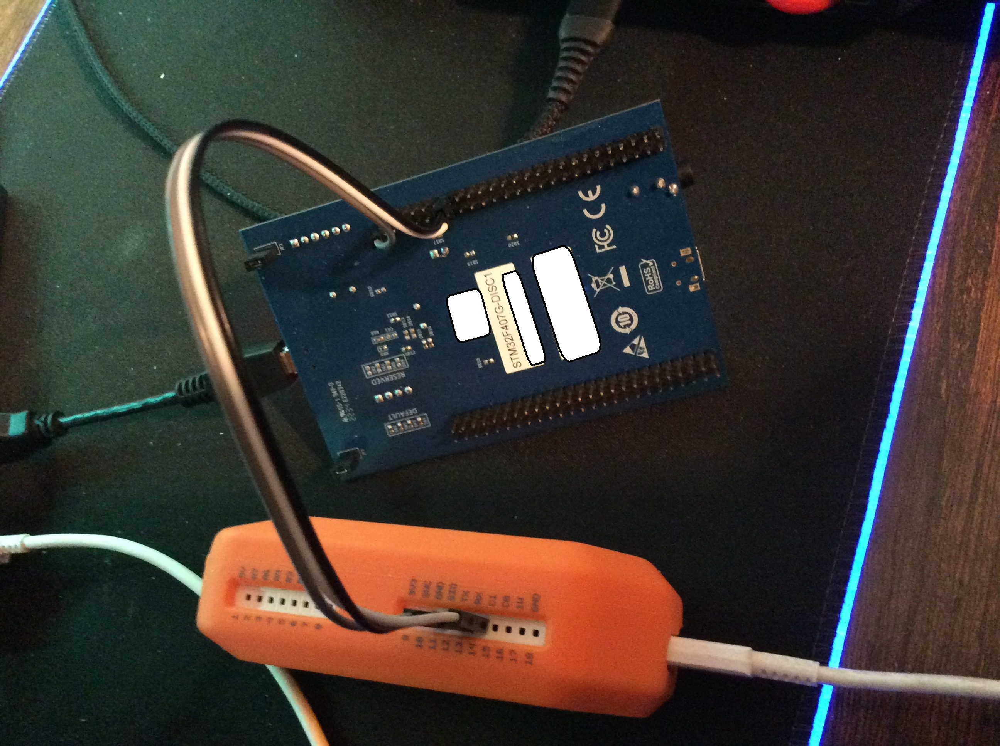
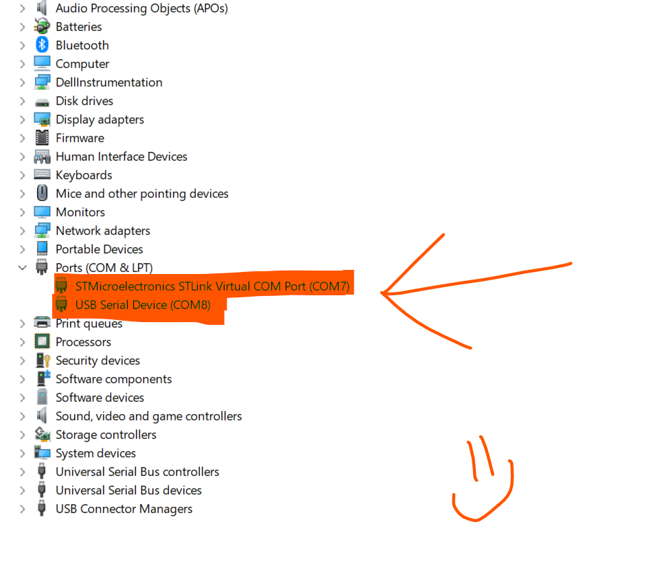
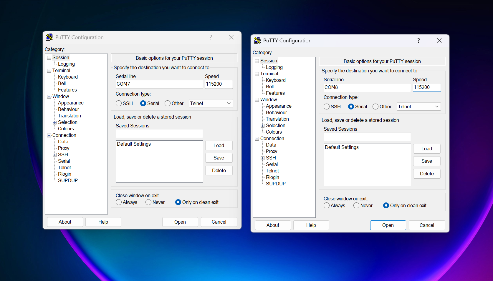
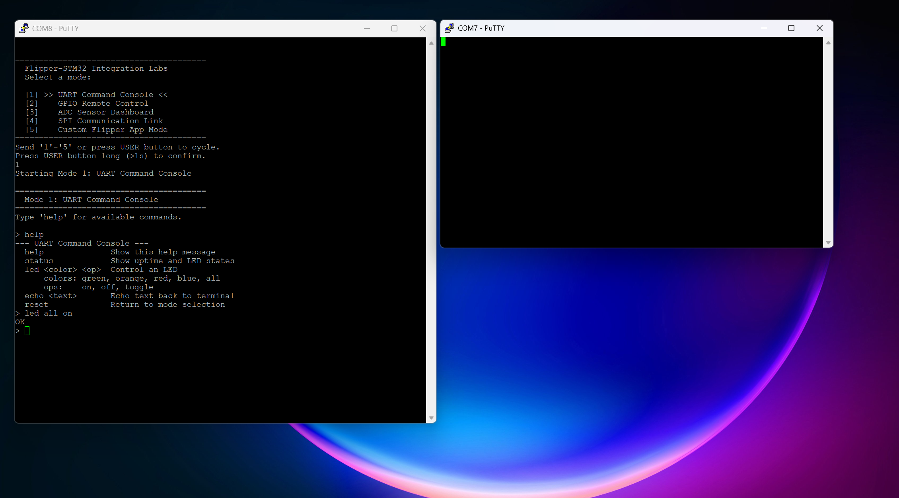
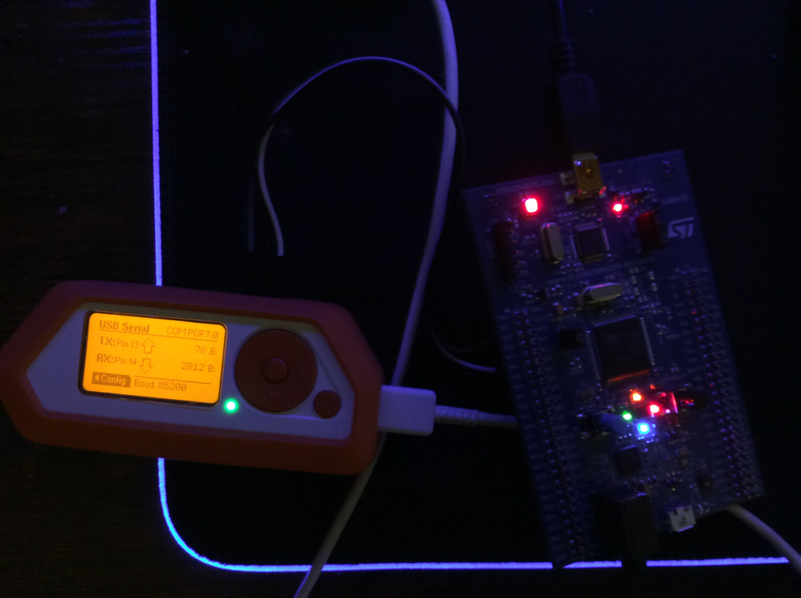

# Flipper Zero + STM32F407G Discovery: Integration Labs

<table align="center">
  <tr>
    <td align="center"><a href="assets/Connections.JPG"></a></td>
    <td><em>3-wire UART setup between the Flipper Zero and STM32 Discovery board</em></td>
  </tr>
  <tr>
    <td align="center"><a href="assets/DevMan.png"></a></td>
    <td><em>Device Manager showing COM7 and COM8 ports for the Flipper USB-UART bridge</em></td>
  </tr>
  <tr>
    <td align="center"><a href="assets/Putty1.png"></a></td>
    <td><em>Setting up two PuTTY terminals for UART communication</em></td>
  </tr>
  <tr>
    <td align="center"><a href="assets/puttyCLI.png"></a></td>
    <td><em>The multi-mode boot menu as seen from PuTTY</em></td>
  </tr>
  <tr>
    <td align="center"><a href="assets/AllLights.JPG"></a></td>
    <td><em>All four LEDs lit up after sending CLI commands over UART</em></td>
  </tr>
</table>


A collection of 5 progressive projects that connect a **Flipper Zero** and an
**STM32F407G-DISC1 Discovery board** together. Each project builds on the last,
taking you from basic UART communication all the way to writing a custom Flipper
Zero app that controls the STM32.

## What You Need

### Hardware
- STM32F407G-DISC1 Discovery board
- Flipper Zero (with SD card inserted)
- 3x female-to-female jumper wires (minimum)
- USB Mini-B cable (for Discovery board programming)
- USB-C cable (for Flipper Zero)
- (Project 3) A potentiometer or analog sensor (optional — onboard temp sensor works too)

### Software
- [STM32CubeIDE](https://www.st.com/en/development-tools/stm32cubeide.html) (free)
- A serial terminal: PuTTY (Windows), minicom, or screen (Linux/Mac)
- (Project 5) [Flipper Zero firmware SDK / ufbt](https://github.com/flipperdevices/flipperzero-ufbt) for building custom apps

## Base Wiring (Projects 1-3: UART)

```
  STM32F407G Discovery              Flipper Zero (GPIO header, top)
  +--------------------+            +--------------------+
  |                    |            |                    |
  |  PA2 (USART2 TX)  o----->------o Pin 14 (RX)        |
  |                    |            |                    |
  |  PA3 (USART2 RX)  o-----<------o Pin 13 (TX)        |
  |                    |            |                    |
  |  GND              o------------o Pin 8 or 18 (GND)  |
  |                    |            |                    |
  +--------------------+            +--------------------+

  TX crosses to RX — this is correct!
  Both boards use 3.3V logic — no level shifter needed.
```

## The 5 Projects

| Lab | Title                   | Difficulty | Key Concepts                          |
|-----|-------------------------|------------|---------------------------------------|
| 1   | UART Command Console    | Beginner   | UART, string parsing, GPIO control    |
| 2   | GPIO Remote Control     | Beginner+  | Binary protocol, structured packets   |
| 3   | ADC Sensor Dashboard    | Intermediate | ADC, timers, data streaming         |
| 4   | SPI Communication Link  | Intermediate | SPI master/slave, new wiring        |
| 5   | Custom Flipper App      | Advanced   | Flipper SDK, GUI, full integration    |

## How It Works: Multi-Mode Firmware

All 5 projects live inside a **single STM32 firmware**. When the board boots,
it shows a menu over UART:

```
========================================
  Flipper-STM32 Integration Labs
  Select a mode:
----------------------------------------
  [1] UART Command Console
  [2] GPIO Remote Control
  [3] ADC Sensor Dashboard
  [4] SPI Communication Link
  [5] Custom Flipper App Mode
========================================
Press USER button to cycle, send '1'-'5' to select.
```

This means you **never need to reflash** just to switch between projects. The
Flipper side uses its built-in USB-UART Bridge for projects 1-4, and a custom
app (stored on its SD card) for project 5.

## Quick Start

1. See [STM32/SETUP.md](STM32/SETUP.md) for CubeIDE project setup
2. See [Docs/wiring_diagrams.md](Docs/wiring_diagrams.md) for detailed wiring per project
3. See [ROADMAP.md](ROADMAP.md) for project status and what's next
4. See [JOURNAL.md](JOURNAL.md) for the learning journal and progress notes

## File Structure

```
Flipper-STM32-Integration-Labs/
├── README.md                  <- You are here
├── ROADMAP.md                 <- Progress tracker and project plan
├── JOURNAL.md                 <- Learning journal with explanations
├── STM32/
│   ├── main.c                 <- Multi-mode firmware (flash this)
│   ├── SETUP.md               <- How to set up the CubeIDE project
│   └── modes/
│       ├── mode1_uart_console.c
│       ├── mode2_gpio_remote.c
│       ├── mode3_adc_dashboard.c
│       ├── mode4_spi_link.c
│       └── mode5_flipper_app.c
├── FlipperApp/                <- Project 5's custom Flipper Zero app
│   ├── application.fam
│   └── stm32_controller.c
└── Docs/
    ├── wiring_diagrams.md
    └── protocol_reference.md
```
